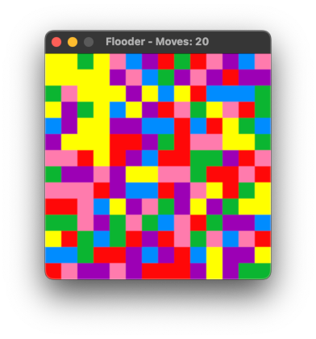

# pyflooder
A simple port of the great puzzle game [https://github.com/Obalfour/Flooder](https://github.com/Obalfour/Flooder) (Game Boy Color) to Python and Pygame.

## Requirements
Runs on Windows, Mac and Linux

Required Python libs:
* pygame

## Start
```
python3 ./PyFlooder.py
```

## Screenshot

